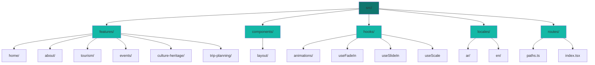

# Gulf Tourism Platform

> A modern, fully responsive tourism website showcasing the beauty and culture of the Arabian Gulf with smooth animations and bilingual support.


---

## Features

- **Bilingual Support** - Seamless Arabic/English switching with RTL/LTR layouts
- **Smooth Animations** - Framer Motion powered transitions and effects
- **Fully Responsive** - Optimized for all devices and screen sizes
- **Type-Safe** - Built with TypeScript for robust development
- **Lightning Fast** - Powered by Vite for instant HMR
- **Modern UI** - Clean, professional design with Tailwind CSS 4

---

## Tech Stack

| Technology | Purpose |
|------------|---------|
| React 19 | Modern UI library with latest features |
| TypeScript | Type-safe development |
| Tailwind CSS 4 | Utility-first styling framework |
| Framer Motion | Smooth animations and transitions |
| React Router DOM | Client-side routing |
| i18next & react-i18next | Internationalization (Arabic/English) |
| Zustand | Lightweight state management |
| Vite | Fast build tool and dev server |

---

## Project Architecture



### Why This Structure?

**Feature-Based Organization**
- Each feature (Home, Tourism, Events, etc.) is self-contained with its own components
- Easy to locate and maintain related code
- Scalable architecture for adding new features

**Reusable Components**
- Shared UI components in `components/layout/`
- Custom animation hooks in `hooks/`
- Consistent design system across all pages

**Internationalization**
- Separate translation files for each feature
- Namespace-based organization prevents key conflicts
- Easy to add new languages or update existing translations

**Type Safety**
- TypeScript throughout the entire project
- Centralized route paths in `routes/paths.ts` prevent typos
- Better IDE support with autocomplete and error detection

---

## Getting Started

### Installation

```bash
# Install dependencies
npm install
```

### Development

```bash
# Start development server
npm run dev
```

### Production

```bash
# Build for production
npm run build

# Preview production build
npm run preview
```

---

## Key Pages

| Page | Description |
|------|-------------|
| **Home** | Hero section with search, featured destinations, and experiences |
| **Tourism** | Comprehensive destination guides with advanced filters |
| **Events** | Cultural events and festivals calendar |
| **Culture & Heritage** | Traditional arts, heritage sites, and customs |
| **Trip Planning** | Interactive trip planner with budget calculator |
| **About** | Mission, values, and why choose Gulf Tourism |
| **Help Center** | FAQ system and support resources |

---

## Design Philosophy

**Color Scheme**
- Dark theme with professional black background
- Teal accents (#0f766e, #14b8a6) for modern feel
- Golden highlights (#D4AF37) for premium touch

**Typography**
- Cairo font family for Arabic text
- Modern sans-serif for English content
- Responsive font sizes for all devices

**Animations**
- Subtle entrance effects using Framer Motion
- Smooth page transitions
- Optimized performance with viewport detection

---

## Author

**Mohamed Fadl**

---

*Built with React and TypeScript for exploring the Arabian Gulf*
